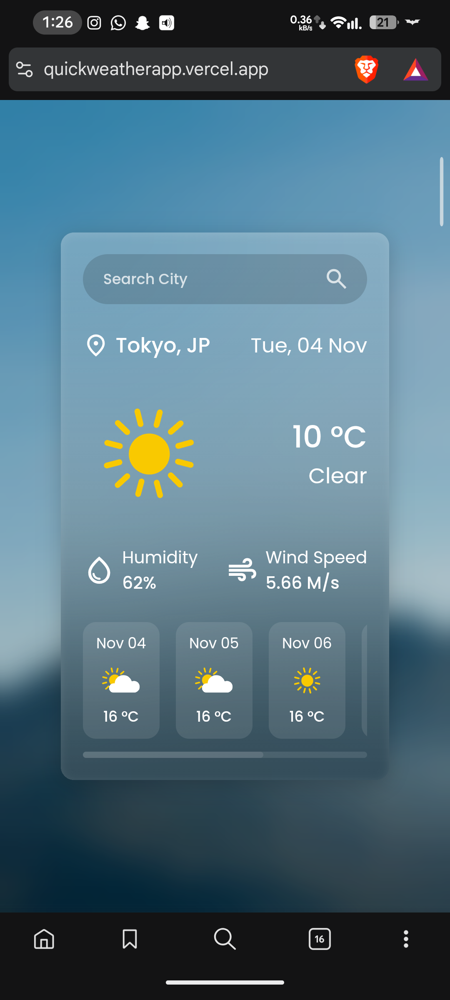
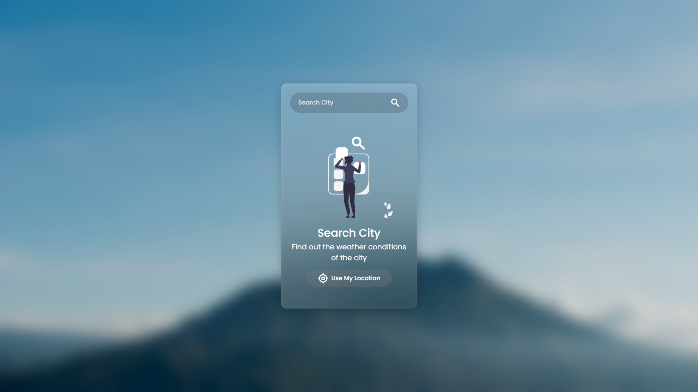
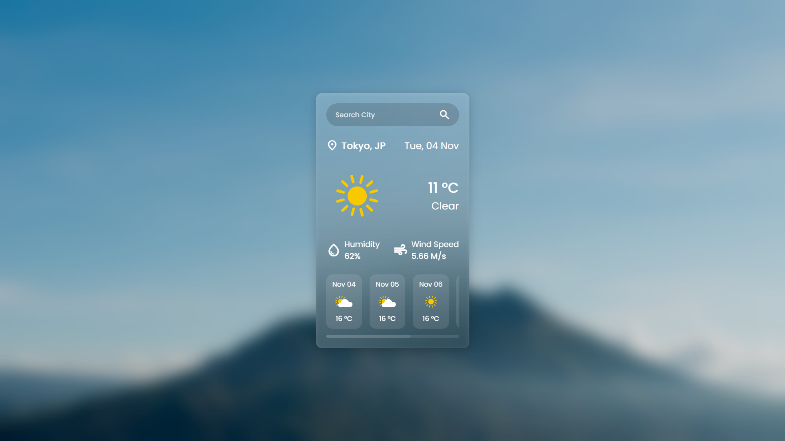
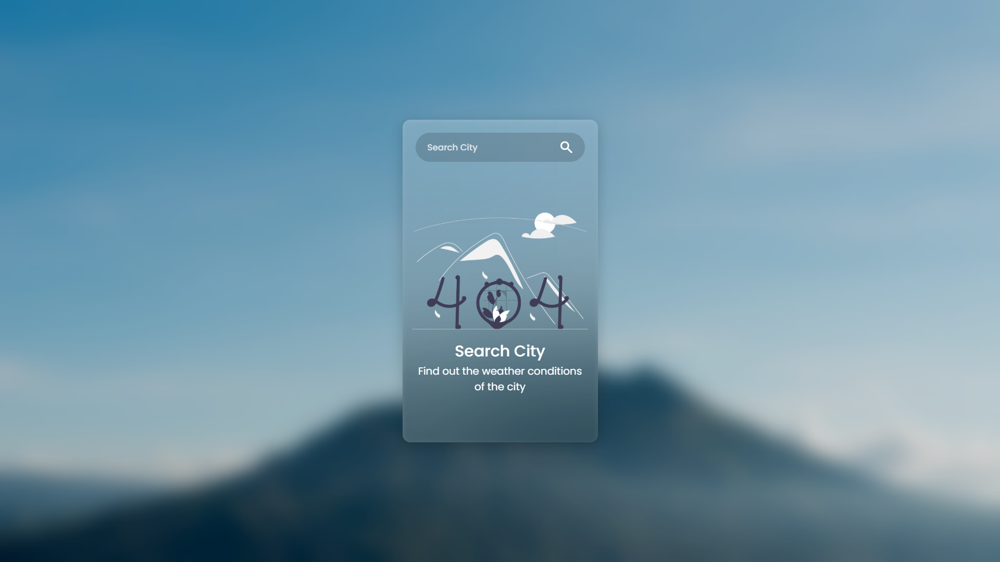

# ☁️ QuickWeather

A clean, modern weather application that helps you check current weather conditions and 5-day forecasts for any city worldwide. Built as a beginner friendly learning project while mastering JavaScript fundamentals and API integration.


## 🌟 Live Demo

🔗 **[View Live App](https://quickweatherapp.vercel.app/)**

---

## 📖 About The Project

QuickWeather is a responsive weather application that provides real-time weather information with a beautiful glassmorphic UI. This project was created as part of my JavaScript learning journey, where I followed a YouTube tutorial for the UI design but implemented all the JavaScript logic independently with AI assistance for learning best practices, code organization, and commenting standards.

### Why This Project?

- 🎯 Learn JavaScript fundamentals (DOM manipulation, async/await, API calls)
- 🌐 Practice working with REST APIs
- 🎨 Implement modern UI/UX design patterns
- 📱 Build responsive layouts for all devices
- 🧹 Understand code organization and best practices

---

## ✨ Features

- 🔍 **City Search** - Search weather for any city worldwide
- 📍 **Geolocation Support** - Get weather for your current location with one click
- 🌡️ **Current Weather** - Real-time temperature, humidity, and wind speed
- 📅 **5-Day Forecast** - Plan ahead with upcoming weather predictions
- 🌤️ **Dynamic Weather Icons** - Visual representation of weather conditions
- 📱 **Fully Responsive** - Works seamlessly on mobile, tablet, and desktop
- 🎨 **Glassmorphic Design** - Modern frosted glass UI effect
- ⚡ **Fast & Lightweight** - Quick loading with minimal dependencies
- 🔄 **Loading States** - Smooth loading animations for better UX
- ❌ **Error Handling** - User-friendly messages for invalid searches

---

## 🛠️ Tech Stack

### Frontend


### Libraries & Tools
- **Day.js** - Lightweight date formatting library
- **Google Fonts (Poppins)** - Typography
- **Material Symbols** - Icon library

### API
- **OpenWeatherMap API** - Weather data provider

### Deployment


---

## 📦 Installation

### Prerequisites
- A modern web browser
- Code editor (VS Code recommended)
- Live Server extension (for local development)

### Setup Steps

1. **Clone the repository**
   ```bash
   git clone https://github.com/vedantparasharr/quickweather.git
   cd quickweather
   ```

2. **Get your API key**
   - Visit [OpenWeatherMap](https://openweathermap.org/api)
   - Sign up for a free account
   - Generate an API key

3. **Configure API key**
   - Open `script.js`
   - Replace the API key constant:
     ```javascript
     const API_KEY = "your_api_key_here";
     ```

4. **Run locally**
   - Open `index.html` with Live Server
   - Or simply open `index.html` in your browser

---

## 🚀 Usage

### Search by City Name
1. Type a city name in the search bar
2. Press Enter or click the search icon
3. View current weather and 5-day forecast

### Use Current Location
1. Click the "Use My Location" button
2. Allow location access when prompted
3. Weather data for your location will be displayed

### Navigate Forecast
- Scroll horizontally through the forecast cards
- View weather predictions for the next 5 days

---

## 🌐 API Reference

### OpenWeatherMap API

**Current Weather Endpoint**
```
GET https://api.openweathermap.org/data/2.5/weather
```

**Parameters:**
- `q` - City name
- `lat` & `lon` - Coordinates (for geolocation)
- `units` - metric (for Celsius)
- `appid` - Your API key

**Forecast Endpoint**
```
GET https://api.openweathermap.org/data/2.5/forecast
```

**Response includes:**
- Temperature (current, min, max)
- Weather condition & description
- Humidity percentage
- Wind speed
- Weather icons
- 5-day forecast data

---

## 📸 Screenshots

### Desktop View


### Mobile View


### Search State


### Weather Display


### Error State


---

## 📁 Project Structure

```
quickweather/
│
├── assets/
│   ├── bg.jpg                    # Background image
│   ├── weather/                  # Weather condition icons
│   │   ├── clear.svg
│   │   ├── clouds.svg
│   │   ├── rain.svg
│   │   ├── snow.svg
│   │   ├── thunderstorm.svg
│   │   ├── drizzle.svg
│   │   └── atmosphere.svg
│   ├── message/                  # UI state images
│   │   ├── search-city.png
│   │   └── not-found.png
│   ├── screenshots/              # Project screenshots
│   │   ├── preview.png
│   │   ├── desktop-view.png
│   │   ├── mobile-view.png
│   │   ├── search-city.png
│   │   ├── weather-display.png
│   │   └── error-state.png
│   └── favicon/                  # Favicon files
│       ├── apple-touch-icon.png
│       ├── favicon-32x32.png
│       ├── favicon-16x16.png
│       └── site.webmanifest
│
├── index.html                    # Main HTML structure
├── style.css                     # Styling & layout
├── script.js                     # JavaScript logic
└── README.md                     # Project documentation
```

---

## 🎨 Key Features Breakdown

### 1. **Smart Weather Icon System**
Dynamic icon selection based on weather condition ID ranges for accurate visual representation.

### 2. **Responsive Design**
Mobile-first approach with flexible layouts that adapt to any screen size.

### 3. **Glassmorphism UI**
Modern frosted glass effect with backdrop blur for an elegant appearance.

### 4. **Smooth State Management**
Toggle between search, loading, weather info, and error states seamlessly.

### 5. **Geolocation Integration**
One-click access to local weather using browser's geolocation API.

---

## 🧠 What I Learned

- ✅ Making asynchronous API calls with `fetch` and `async/await`
- ✅ DOM manipulation and event handling in JavaScript
- ✅ Working with external APIs and handling responses
- ✅ Implementing loading states and error handling
- ✅ CSS glassmorphism and modern UI techniques
- ✅ Responsive design with flexbox
- ✅ Code organization with comments and sections
- ✅ Using ES6 modules for cleaner imports
- ✅ Browser geolocation API integration
- ✅ Date formatting with external libraries

---

## 🚧 Future Enhancements

- [ ] Add hourly forecast
- [ ] Implement dark/light theme toggle
- [ ] Add weather alerts and notifications
- [ ] Save favorite cities (localStorage)
- [ ] Display air quality index
- [ ] Add weather maps
- [ ] Multi-language support
- [ ] Animated weather backgrounds
- [ ] Voice search functionality
- [ ] PWA support for offline access

---

## 🤝 Contributing

Contributions are what make the open-source community amazing! Any contributions you make are **greatly appreciated**.

1. Fork the Project
2. Create your Feature Branch (`git checkout -b feature/AmazingFeature`)
3. Commit your Changes (`git commit -m 'Add some AmazingFeature'`)
4. Push to the Branch (`git push origin feature/AmazingFeature`)
5. Open a Pull Request

---

## 📝 License

This project is open source and available under the [MIT License](LICENSE).

---

## 👨‍💻 Author

**Vedant Parashar**

- 💼 LinkedIn: [Vedant Parashar](https://www.linkedin.com/in/vedant-parashar-4843a4233/)
- 💻 GitHub: [@vedantparasharr](https://github.com/vedantparasharr)
- 📧 Email: [iemvedant@gmail.com](mailto:iemvedant@gmail.com)

---

## 🙏 Acknowledgments

- YouTube tutorial for UI design inspiration
- [OpenWeatherMap](https://openweathermap.org/) for providing free weather API
- [Day.js](https://day.js.org/) for easy date formatting
- [Google Fonts](https://fonts.google.com/) for Poppins font family
- [Material Symbols](https://fonts.google.com/icons) for beautiful icons
- AI tools for helping me learn best practices and code organization

---

## 📊 Project Stats


---

<div align="center">

### ⭐ Star this repo if you found it helpful!

Made with ❤️ by Vedant Parashar

</div>
